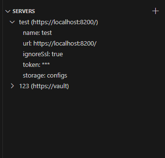
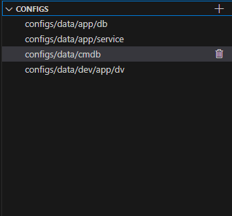
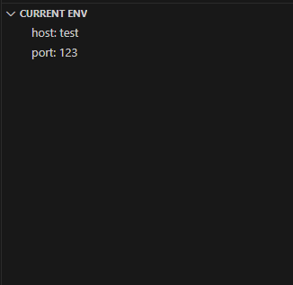

# Vault Env VS Code Extension

Vault Env is a Visual Studio Code extension that allows you to securely fetch, view, and use secrets from HashiCorp Vault directly in the editor. It supports the KV secrets engine (v2), nested folders, and viewing/copying environment variables.

## Features
- Fetch a list of all secrets and variables from Vault
- Recursively browse nested secret folders
- View and copy secret values
- Quickly add variables to your project environment
- Support for multiple Vault instances and paths

## Installation
1. Open Visual Studio Code
2. Go to Extensions (Ctrl+Shift+X)
3. Search for "Vault Env" and install the extension
4. Restart VS Code if necessary

## Quick Start
Open the extension tab:

To add a new server, click the + button to the right of servers.
In the popup, enter a unique name for the server.
Then expand the server settings; you will see the following fields:
- name: server name
- url: server address
- ignoreSsl: ignore certificate errors
- token: Vault token to use
- storage: name of the secret storage engine
Click any parameter to edit it.

After configuring the server connection, click the root element of the server to load the list of all secrets available to you from Vault:

Clicking a secret will instruct VS Code to load it into the environment variables for all new terminals.

The env tab shows the loaded environment variables:

## Requirements
- Access to HashiCorp Vault (v1.0+)
- Permissions to read secrets (READ, LIST)

## Contribution
Pull requests and suggestions are welcome! Open an issue for bugs or ideas.

## Version History

### 0.0.3
- add show/hide command
- add close env command

### 0.0.2
- Improved secret browsing and nested folder support
- Added environment variable view and copy features
- Enhanced server configuration UI
- fix bug with module's importe

### 0.0.1
- Initial release
- Basic Vault connection and secret listing
- Support for multiple servers

## License
MIT License

